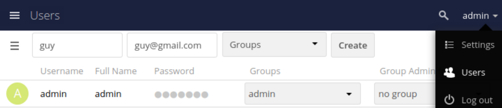

## Getting ownCloud up and running

ownCloud is a flexible open source solution for file sharing and synchronization.

The solution consists of the ownCloud server, which runs on Linux; client applications for Microsoft Windows, Mac OS X and Linux; and mobile clients for the Android and Apple iOS operating systems.

This quick start demonstrates how to get a server up and running and enable users to connect to the server using an ownCloud client application.

To do this, we will:

-	[Install and configure an ownCloud server](#installing-and-configuring-the-owncloud-server)
-	[Create a user account](#creating-a-user-account)
-	[Connect to the server using a desktop or mobile application](#connect-to-the-owncloud-server-using-a-desktop-or-mobile-application)

## Installing and configuring the ownCloud server

To install the ownCloud server, you need a Linux machine, a web server, a database, and PHP runtime.

We recommend this environment for best performance, stability, support, and full functionality:

Platform	| Recommendation
-|-
Operating system | Ubuntu 18.04 LTS
Database | MariaDB 10+
Web server | Apache 2.4 with prefork and mod_php
PHP runtime | 7.4

> **Note:** For other supported environments, see [ownCloud software requirements](https://doc.owncloud.com/server/10.6/admin_manual/installation/system_requirements.html).

You can install ownCloud in multiple ways, including with Docker and Linux Package Manager.

Select an installation method and follow the steps described in the [installation guides](https://doc.owncloud.com/server/10.6/admin_manual/installation/docker/) to install your ownCloud server.

## Creating a user account

Now that your server is running, to add a user account:

1. Log in to the ownCloud web console:

    1. Open http://localhost in your browser.
    1. Enter the admin user and password you set in the `.env` file during installation.
    1. Select **Users** from the dropdown in the top right-hand corner of the screen.

       This opens the **Users** screen.

       

1. Set the **Username** and **E-Mail** field values.  

    - **Username** is the unique ID of an ownCloud user. The username you set cannot be changed.
    - **E-Mail** is the email address to which the system sends an email prompting the user to set a password. Both the user and the admin can change the user’s email at any time.

1. Click **Create**.

    You can now find the new user account in the list of users on the **Users** screen.

For more information about user configuration, see [User Management](https://doc.owncloud.com/server/latest/admin_manual/configuration/user/user_configuration.html).  

## Connect to the ownCloud server using a desktop or mobile application

To connect to the ownCloud server as a user:

1. Download and install the application:

    - To use the desktop app:

        1. [Download the desktop application for Mac OS, Windows or Linux](https://owncloud.com/desktop-app/).
        1. Double-click the file you download and follow the installation wizard.

    - To use the mobile application, [download and install the mobile application for iOS or Android from Apple Store or Google Play](https://owncloud.com/mobile-apps/).

1. When you launch the application for the first time, the application prompts you to set your server address. Set the address to `http://<server_ip_address>:8080`.

    That's it! You are now connected to your ownCloud server.

For more information about using the client applications, see the [desktop client and mobile apps documentation](https://doc.owncloud.com/server/10.6/#desktop-client-and-mobile-apps).
